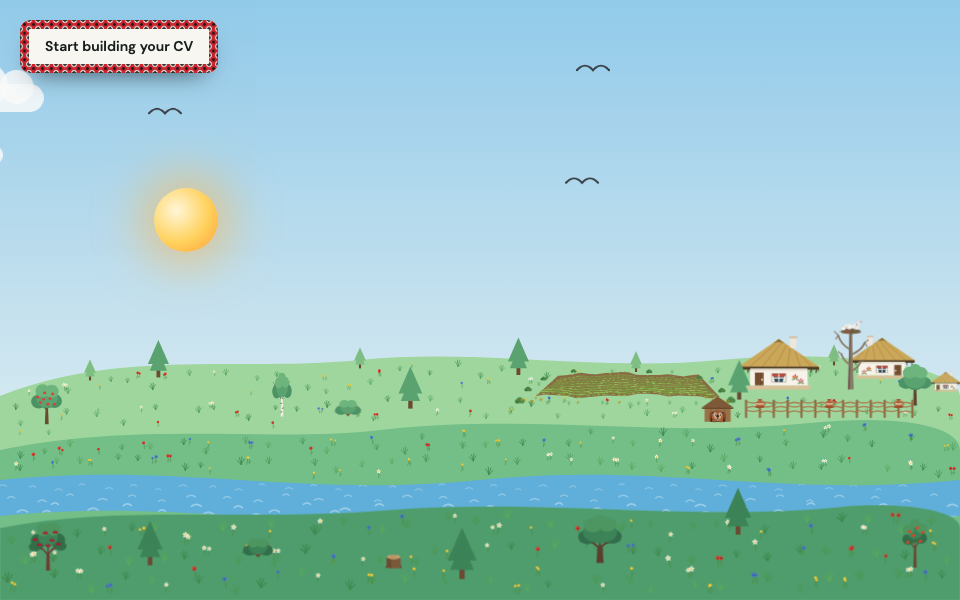

# not boring CV

A résumé builder that opens on a Ukrainian village at dawn.

**[Try it →](https://vik753.github.io/cv-app-cloude/)**



Fill in a form on the left, watch the page take shape on the right, print it to PDF when
you are done. That part is ordinary. The part that is not is what happens before you
start, and what runs behind everything once you do.

---

## How it opens

Three states, in this order:

1. **The welcome screen.** The village is there, held on its first frame — silent, still,
   one button in the middle of the screen. Nothing moves yet.
2. **The scene.** That click starts the animation and the music together. A full day and
   night passes in 46 seconds, the season turns with every cycle, and the village gets on
   with its life. Stay as long as you like.
3. **The builder.** One button and the scene stops entirely — no animation behind the
   form, nothing competing for the machine. Another button in the header takes you back.

The pause on the first screen is not decoration. Browsers refuse to play audio before a
user gesture, so the button is the gesture: it is what lets the animation and the
soundtrack begin together instead of the music failing silently.

If you already have a draft saved, the app skips all of this and opens straight in the
builder. You came to work, not to watch.

## The village

The scene is the project, not its background.

Four seasons cycle endlessly: summer meadows with wildflowers, autumn rain and falling
leaves, snowfall and a frozen river, then the thaw and snowdrops. A wolf comes out at
night, crosses the lower meadow and howls at the moon from a stump. A hare gnaws the
birch and leaves a mark on the bark. A hedgehog carries a fallen apple home on its
spines, and hibernates once winter comes. A fox hunts by day. The yard dog does its
rounds of the хати, lifts a leg at one, and a slipper flies out of a window. Children
roll a snowman and skate on the ice. Women sow the field in spring, weed it in summer,
and bind sheaves in autumn behind a man with a scythe — all of them routed off the same
schedule the field is mown on, so nobody is ever bending over wheat that is still
standing. Two neighbours wander home arm in arm in the evening, singing.

A candle lights in a window after dark, and the flame, the halo, the spill down the wall
and the pool of light on the grass outside all flicker from one loop — because one candle
would light them all.

It is drawn in SVG, posed frame by frame from a single clock read off the sky's own CSS
animation, and every figure is original work.

## What the builder does

- **Print is the export.** No PDF library — the print stylesheet _is_ the output, laid out
  for A4.
- **English and Ukrainian**, interface and all.
- **Three palettes**, light and dark, following your system preference until you say
  otherwise.
- **Skill icons** with autocomplete, from [skillicons.dev](https://skillicons.dev).
- **A completion meter**, so you can see what is still missing.
- **Nothing leaves your browser.** No backend, no API, no account. The draft lives in
  `localStorage` and nowhere else.

## Built with

React 19 · TypeScript · Vite 8 · Tailwind CSS 4 · Zustand · React Hook Form · Zod ·
Radix primitives · Phosphor icons · Vitest

No router (there is one page), no server state library (there is no server), no component
kit — the handful of primitives that need wrapping are wrapped by hand.

## Architecture

[Feature-Sliced Design](https://feature-sliced.design/), enforced by the linter rather
than by good intentions:

```
app       providers, styles
pages     builder
widgets   scene, app-footer
features  resume-form, resume-preview, palette-switch, language-switch
entities  resume
shared    ui, lib, i18n, config
```

Imports run downward only, and a slice is reached through its `index.ts` — never by a path
into its internals.

## Running it

Node 24, npm.

```bash
npm ci
npm run dev
```

|                      |                                                  |
| -------------------- | ------------------------------------------------ |
| `npm run dev`        | dev server                                       |
| `npm run build`      | typecheck, then production build                 |
| `npm run preview`    | serve the production build at the real base path |
| `npm run test`       | Vitest                                           |
| `npm run lint`       | ESLint, zero warnings allowed                    |
| `npm run lighthouse` | a Lighthouse run against the production build    |

Every commit runs Prettier, ESLint, TypeScript and the full test suite before it lands.

A note on measuring: use `preview`, never `dev`, and a Chrome profile with no extensions.
The dev server ships unbundled modules and an extension can add hundreds of requests to
the page under test — between them they are worth sixty points of a Performance score,
which this project learned the hard way.

## Credits

Music streamed through the official YouTube player, so nothing copyrighted lives in this
repository and plays are credited to the artist. Skill icons by
[skillicons.dev](https://skillicons.dev). Everything else — the village, its cast, the
embroidery on the buttons — drawn for this project.

## Licence

[MIT](LICENSE). Use it, change it, ship it, sell it — just keep the copyright notice.

## Author

Ihor Korenets · vik753@gmail.com · 2026
